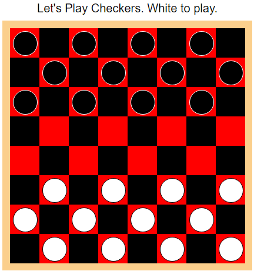
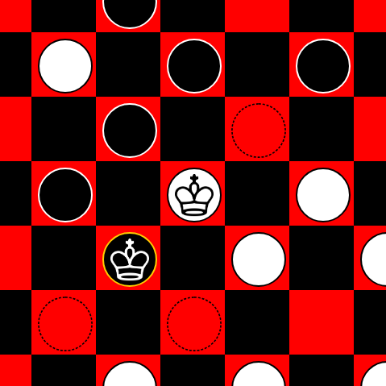

# web-checkers
Author: Jake Albert  
Basic checkers game implemented in HTML, CSS, and JavaScript.  
Acknowledgement: Crown clipart obtained through [Pixabay](https://pixabay.com/en/king-white-chess-figure-game-play-147056/).  

-------------------------------

Usage:
  * Clone: `git clone https://github.com/jake-albert/web-checkers.git`
  * Play: open **html/index.html** in any web browser, such as Chrome.

-------------------------------

## Board appearance

-------------------------------

## Movement selections

